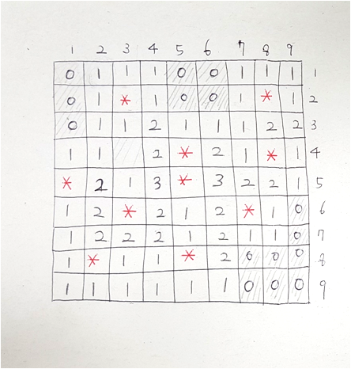
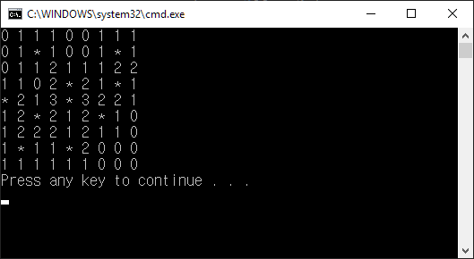

# 지뢰판 그리기

### 지뢰찾기 알고리즘
- TODO: 지뢰찾기 알고리즘 설명이 여기 있어야 함

### 지뢰판을 종이에 그리기
- 준비한 종이에 9x9 크기의 격자를 그립니다.
- 지뢰 10개를 빨간팬으로 ∗ 모양으로 그려 봅니다.
- 나머지 칸에 숫자를 채웁니다.

### 종이에 그린 지뢰판을 컴퓨터로 옮기기
- 다음과 같은 결과를 얻는 코드를 만들어 봅시다.

- 각 아이템(숫자, 폭탄)의 구분은 공백으로 합니다.

- MineSweeper.Tests를 통과 해야 합니다.