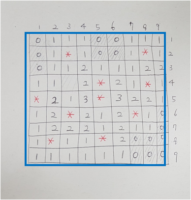
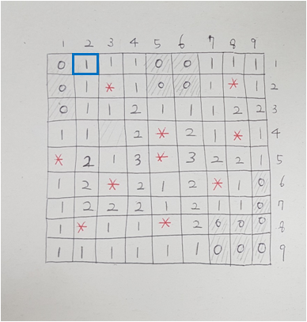

# 숫자 채우기

### 지뢰찾기 알고리즘
- TODO: 지뢰찾기 알고리즘 설명이 여기 있어야 함

### OOP 형태로 구조를 개선하기

- TDD(테스트 주도 개발)을 위하여 객체 지향 구조를 설계합니다.
- Class MineMap

- Class MineItem

### Class MineItem
- bool IsBomb 속성 : 폭탄이면 true, 아니면 false
- int NearBombsCount 속성 : 주변 8칸에 존재하는 폭탄의 개수

### Class MineMap
- void GenerateAllNearBombs : 숫자를 채우는 함수

### 숫자 채우기
- 테스트 코드를 수정하지 않고 모든 테스트가 통과 하는 코드를 작성 합니다.
- hint. if문과 for문을 사용하면 쉽게 해결 할 수 있습니다.